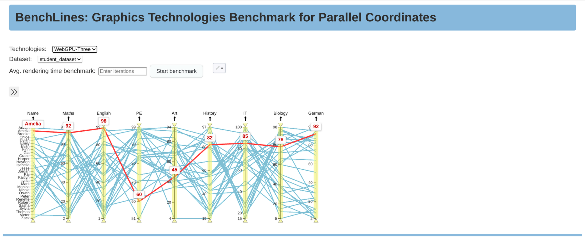

# BenchLines

BenchLines is an open-source JavaScript library which implements a steerable parallel coordinates visualisation. The visualisation has built-in interactive controls as well as an API which allows the visualisation to be controlled (steered) externally. 

<!-- The library is written in TypeScript and is based on [D3](https://d3js.org/). -->



This project is a fork of the original [SPCD3 teaching repository](https://github.com/tugraz-isds/spcd3) created by the Institute of Human-Centred Computing at TU Graz.

Our fork adapts and extends the original material for the [Information Architecture and Web Usability](https://courses.isds.tugraz.at/iaweb/) course with a focus on WebGPU/WebGL comparisons, performance exploration, and interactive data visualisation techniques.

## Project goals
- Provide a clear overview of Canvas2D, SVG-DOM, WebGL, and WebGPU technologies.
- Compare these technologies in terms of usability, performance and modern GPU capabilities.
  
## Deployed version of the project 🌐
You can access the deployed version of the project at [https://filip-ljubotina.github.io/benchlines/](https://filip-ljubotina.github.io/benchlines/).


The task runner [Gulp](https://gulpjs.com/) is used to automate
repeatable tasks and [Rollup](https://rollupjs.org/)
is used to bundle and build the library.


## Getting Started

### Prerequisites

Open terminal and execute the following command to install all the dependencies:


``` 
yarn
```

### Build And Development

Gulp is used to automate repeatable tasks. The file [gulpfile.js](gulpfile.js)
defines four public tasks:

<br/>

`clean` removes the existing `dist/` directory in
order to enable a clean rebuild of the project:
```
npx gulp clean
```

<br/>

`cleanAll` restores the project folder to its virgin state,
by deleting the existing `dist/` and `node_modules/` directories
and the `yarn.lock` file:
```
npx gulp cleanAll
```

<br/>

`build` creates a new build of the library in three formats (CJS, ESM, IIFE)
and stores the generated library packages into the `dist/library/` folder.
Additionally, the example folder is copied to `dist/example/`:
```
npx gulp build
```

<br/>

`serve` executes the build task, then additionally executes a private task
called watcher, which starts live web server in the `dist/example/` folder:
```
npx gulp serve
```

<br/>

Each of the public Gulp tasks can also be invoked by running the
equivalent npm script defined in package.json.

**Important:** To run the build, a live web server must be started.

## Usage

BenchLines is used to benchmark and visualize the performance of various 
rendering technologies and libraries.

<!-- The [API Guide](./API.md) lists all available functions in BenchLines'
API. -->

An example application was built to illustrate the use of the BenchLines
library. It is described in the [Example Application
Guide](./EXAMPLE.md).


## Data-Handling

A CSV file is required to visualise a dataset as a parallel coordinate
plot. The CSV should be separated by a comma. Otherwise, there are no
special requirements. Data dimensions can be categorical or
numerical. Three example datasets can be found in folder
[data](./src/example/data/). Other datasets should have the same
structure.


## License

This project is distributed under the MIT License. See [LICENSE](LICENSE) for
more information.


## Contributors

- Michael Anderson [michael.anderson@student.tugraz.at](mailto:michael.anderson@student.tugraz.at?subject=BenchLines)  
  PhD Student

- Jyothish Atheendran [jyothish.atheendran@student.tugraz.at](mailto:jyothish.atheendran@student.tugraz.at?subject=BenchLines)  
  MSc Student

- Filip Ljubotina [filip.ljubotina@student.tugraz.at](mailto:filip.ljubotina@student.tugraz.at?subject=BenchLines)  
  Student


